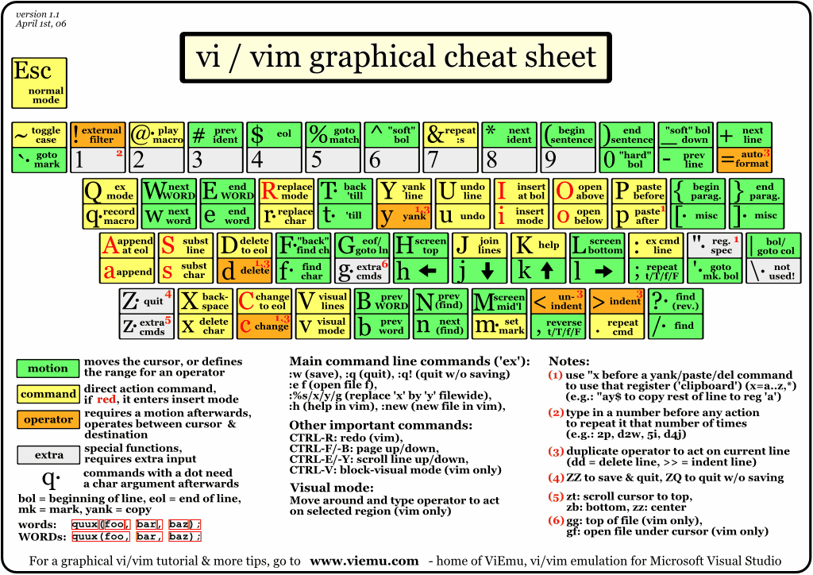

# 前言
虽说是要写这么个东东, 但是其实这个东西随便网上一搜就是一大把, 根本不用写.

但是, 话又说回来了, 这些教程还是有些太过理论了, 在我看来, CLI应该是一个和GUI界面一样普遍的东西, 更像是使用电脑这样的常识而不是一种技能或知识.
## 啥是CLI?
CLI, 也就是Command Line Interface, 那个经常看见的黑框框, 是和GUI, 也就像Graphical User Interface 一个概念的**操作界面**, 就像你在图形化系统里点开一个网页亦或是打开文件资源管理器一样, CLI也可以做到, *只不过不用鼠标* , 所以非常有效率
#  找到, 然后打开
那你想用这个东西首先得打开, 对吧. 与GUI操作系统会在启动的时候自动打开外(linux系的除外), CLI有三种交互方式:
1. 在GUI以窗口的形式打开
2. 用ssh(Secure Shell)远程连接
3. ~~使用电传打字机(teletype)物理通信~~
当然3有点非物质文化遗产的感觉, 而且就算你想, 你能买到电传打字机吗?

2的话当然也没有必要, 显然来看这个教程的人也不会有两台电脑同时开着(如果有的话请忽略这句话)

所以就只剩1啦, 当然, 在本地打开终端, 最好的方式也就是1

## Windows
相比各位都刷到过那种黑客视频吧, 就是打开cmd输入`dir /s`刷屏的那种. 诶, 我刚才是不是说出了这个东西的名字, 对就是这个--**CMD命令提示符**.

打开这个东西有很多方法, 简简单单说几种最常用的:
- `win+R` 打开一个运行窗口, 输入cmd, 回车.
- 打开文件资源管理器, 在搜索栏输入cmd, 回车.
- 打开文件资源管理器, 在文件那边右键, 用命令提示符打开, 点一下.

当然win上还有个东西叫做Powershell, 在开始菜单上就能找到, 现阶段可以认为这俩是等价的.

## MacOS
打开"终端" 或terminal这个应用程序, 是的, 就这么简单.

## Linux
用这个的还会看嘛.

# 其实就是文件资源管理器...
为什么要这么说呢? 你就看他俩像不像吧:

## 文件系统与路径
那这时候有人就要问了: 这个"C:\Users\Administrator"是什么呀?

ok, 问的好~~自导自演这一块\\.~~, 这是一个称作为**路径**的东西. 肯定你也注意到了, 你翻文件夹的时候, 这个东西都会随之改变, 把你这一条路翻到的文件夹的名字都写上去, 来告诉你在哪里.(其实网站也是一样的)

就像一个柜子里装了5个箱子, 一本书装在了绿色的箱子里, 那你让别人找的时候就要告诉他: *你帮我找一下装在柜子里的绿色箱子里的那本书* , 操作系统自然也是同理.
## 在哪
回到终端, 这个`C:\Users\Administrator` 自然是告诉你了你现在在哪. 当然如果他不告诉你, 你也可以输入pwd(print working directory显示工作目录 来让它告诉你). 这里出现了一个working directory的词, 就是你现在在的位置的意思啦.

## 这里有啥
现在操作系统回应了你在哪这个问题, 但是光知道在哪有毛用啊, 关键是要干什么, 对吧? 那自然要先知道有什么.

与文件资源管理器直接显示这里有什么不同, 你要自己问: 输入ls(Linux/MacOS或者dir(Windows), 就可以显示这里有啥了

这里换到了mac, 方便一点. 发现这里有一个111的文件夹和一个hello.txt的文件. 

## 要去哪
那就去111这个文件夹看看吧. `cd 111`就可以了,  cd就是Change Directory切换目录的缩写.

就和文件资源管理器一样, 你就到了111这个文件夹里了.

顾名思义Change Directory 是改变一个路径, 既然是那你肯定得告诉操作系统一个路径吧, 所以`111`就是这个**命令的参数** 也就是告诉操作系统额外的信息.

还有一个问题, 既然我给操作系统的是一个路径, 那为啥`111`也可以呢, 事实上路径在CLI界面可以是很多样的, 比如(这里拿类Unix系统举例):
- `/home/guest` 以`/`开头的是绝对路径, 相对于根目录, 也就是最外面那个只能进不能出的地方
- `./111`或`111`以`./`开头的是相对路径, 相对于当前工作目录, 代表了从现在这个位置往下的哪个地方
- `~/Desktop` 以`~/`开头的是相对路径, 相对于用户目录, 自然的`~`下面的东西都是归你管的
- `../`或`..`代表上级目录, 相对于工作目录上面那一层
- `./*`或`*`通配符, 代指这个目录下的所有东西, 其实这个不能算狭义上的路径了
所以`111` 的意思就是在当前目录下的111文件夹,  `cd 111`就是进到`111`里面去.

进去看一眼吧, 也是啥都木有~

## 文件操作
现在知道了如何查看不同目录, 那在文件资源管理器里还可以干啥呢? 对了, 就是创建/打开/删除/更新文件(夹)对吧. 于GUI界面繁琐的右键菜单不同, 这边可以用简单的一行命令解决, *甚至双手都不需要离开键盘!*
### 创建
刚才说到那了来着? 对了, 我们现在在`~/myDirectory/111`这个目录下, 什么都没有, 那就创建一些东西吧
#### "新建文件夹"
在当前目录新建一个222文件夹吧:
```bash
mkdir 222
```
再`ls`一下:
```bash
> ls
222
```
也是成功了好吧, 简单吧.

mkdir顾名思义就是Make Directory创建目录, CLI的这个新建文件夹可比GUI的灵活多了, 你可以:
- `mkdir 222/333` 再在222目录下创建一个333(前提是222要存在)
- `mkdir ../aaa`在上一级目录, 也就是`~/myDirectory`新建一个aaa
来来来, 找规律. 对了~~谁问你了~~! mkdir 后面跟的也是一个目录, 它会cd到最后一层目录的上一层创建一个文件夹. 因为`mkdir 222`的上一层目录就是当前目录, 也就是`.` , 所以就是在当前目录创建一个222
#### "新建文本文档"
在当前目录再新建一个文件吧:
```bash
touch 123.txt
```
再ls一下:
```bash
> ls
222 123.txt
```
也是非常滴简单.

和`mkdir`一样 也是到文件的上一级目录创建那个文件, 所以也可以填路径(操作文件命令的都是这样的)

其实在CLI界面文件扩展名这个东西是没有任何作用的, 只不过方便人和GUI界面查看.
### 删除
相信各位有的都听过这么一个梗: `rm -rf /*` 清理系统运行垃圾, 当然肯定不是的对吧. 接下来, 就来介绍一下这个最危险的命令`rm`.

刚才创建了这么多东西, 也该删一删了, 那就从`123.txt`开始吧:
```bash
rm 123.txt
```
各位应该也都熟悉这套东西了, rm, 也就是remove移除, 就是把当前目录下的123.txt删掉, 非常简单, 没啥说的.

同理, 把222这个文件夹也删了.
```bash
> rm 222
rm: 222: is a directory
```
恭喜你, 被操作系统骂了! 内容是"222是一个目录", 而不是文件, 所以删不掉.

你现在肯定想, rm什么垃圾, 连目录都删不了, 那你可就错怪它了, 它其实只不过不知道这是一个目录.

那怎么告诉它这是一个目录呢, 需要加一个flag`-d`也就是directory:
```bash
>rm -d 222
rm: 222: Directory not empty
```
oh no 又不行, 这操作系统事咋这么多, 仔细看一眼, 222不是空的. 因为如果你加了`-d`, rm会认为你只是想删222本身, 但显然, 222里面还有个333, 所以它拒绝了你.

那怎么办呢, 遇事不决, 加个flag--`-r` 也就是recursive, 递归的删除里面的所有东西:
```bash
>rm -r 222
>ls
```
可以看到, 111里面已经什么都木有了.

不过还记得刚才创建的`aaa`吗, 走, 去霍霍它去:
```bash
> cd ..
> ls
aaa 111 hello.txt
> rm -d aaa
> ls
111 hello.txt
```
因为aaa是空的, 所以使用`-d`就可以清理掉了.

rm还有二次确认和显示删了啥的flag, 各位可以自己探索下~
### 更新
再看一眼windows的右键菜单, 还有啥来着, 哦对了, 还有复制/剪切/重命名. 那一个一个说.
#### 复制
霍霍下这个hello.txt吧, 一直还都没动过它:
```bash
> cp hello.txt world.txt
> ls
111 hello.txt world.txt
```
这边第一次输了两个参数, 和上面的touch那些一样, 就不讲第三遍了. 然后这个复制文件夹要用`-r`遍历的复制, 跟rm一样.

cp, 顾名思义, copy复制(这个也讲了很多遍了, 谁叫程序员命名这么爱偷懒T_T).

没啥说的, 就是吧`hello.txt`(source源)复制了一个到`world.txt`(目标)而已.

#### 剪切/移动/重命名
其实这俩本质上是同一个东西, 你仔细想想, 是不是都可以是先把一个文件丢进剪切板, 再换个目录:
```bash
> mv hello.txt ./111
> ls
111 world.txt
```
这样操作就是移动, 也就是第二个参数是目录的情况.

虽然很不情愿, 但是再顾名思义一下吧, mv就是move移动.

然后我看这个world.txt不顺眼很久了, 世界这么大, 为啥要是小写嘛~~没人比你更会找茬~~
```bash
> mv world.txt WORLD.txt
> ls
111 WORLD.txt
```
反正它变成大写的了, 这样操作就是重命名了, 也就是第二个参数是文件的情况, 当然其实只是判断下当前目录的这个名字是不是目录而已, 所以你想`mv 111.txt aaa`重命名成aaa也是可以的.

那其实还差了一件事, 如果想把一个文件夹套到另一个里面呢:
```bash
> mkdir aaa
> mv 111 ./aaa
> ls
aaa WORLD.txt
> cd aaa
> ls
111
> cd 111
> ls
hello.txt
```
成功喽, 也是非常滴简单, 和移动文件也没啥区别.

最后, 再介绍一个GUI非常难搞, 但是CLI就非常简单的操作, *把当前目录下的所有文件转到上一目录*:
```bash
> cd ..
> touch 2.txt
> ls
2.txt 111
> mv ./* ../
> ls

> cd ..
> ls
2.txt 111 aaa WORLD.txt
```
本人认为这个是CLI最好用的命令之一:`mv ./* ../` 这里又出现了`*`这个通配符, 相当于全选. 所以整个命令的意思就是: *把当前目录下的所有文件和文件夹移动到上一级目录*. 在GUI界面, 你得开两个窗口才能实现这一动作.

# 打开
为啥我要单开一个呢, 因为这个内容比较多.

接下来的内容里涉及到了很多windows没有的工具, 所以建议使用WSL(Windows Subsystem for Linux) 我就不讲了, 这个教程也一大把.

## vim
在终端中, 干的最多的事可能就是改各种文件和写各种文件了, 所以会用终端里的文本编辑工具还是很有用的, 而vim就是干这个事的.

俗话说: *记事本是最好的代码编辑工具*, 那这个称号在CLI界面里可能就是vim了. 其实终端里并不是只有vim这一个编辑工具, 还有nano/vi这些系统自带的, 所以如果不常用, 也可以用这些(而且vim和vi的操作方式也是通用滴), 如果是后面还要拿vim写代码之类的, 那还可以用neovim.

### 安装
刚才说到, vim不是系统自带的, 所以得先安装, 如何在终端里安装东西呢? 那就看看包管理这章吧.
### 那就先打开...诶等会, 怎么关啊?!
先输入它的大名打开它: `vim`, 然后你就会进入到一个与正常终端界面十分不同的界面:

第一次见这个还是很感觉很帅的, 但之后不识洋文的我就意识到了一件事: 怎么关啊.

按万能的ctrl+c(中断)也是毛用没有, 但是如果识洋文的话就知道`exit`是退出的意思, 于是你输入了`:q`成功的退了出去, 恭喜.
### 打开是打开了...
既然这是个文本编辑器, 那怎么写东西呢? 现在脸滚键盘都没一点反应.

这就要说到vim的模式了, vim有5种模式: normal/command/insert/replace/visual, 而刚才进入的就是normal模式, 输入`:q`进入的就是command模式. 通过一些按键就可以在不同的模式间转换, 而编辑模式自然就是insert了.

按一下insert的首字母--`i`, 就进入到编辑模式了, 怎么样, 简单吧.

现在可以脸滚键盘了, 那接下来又有了一个同样的问题: 怎么退出去?

直接按`:q`肯定是不行的, 因为command模式只有在normal模式下才能进入. 不过你想想, 平时打游戏要退出都是按哪个键的? 对了, 就是`ESC`!

按一下也就回到了normal模式, 再按`:q`退出吧, 额...vim又骂人了, 还骂两句:

那就一个一个看, 第一句说没有保存, 因为`:q`其实只是退出, 如果要保存的话还得`:w`而组合起来就是`:wq`"保存并退出", 当然如果你不想保存也可以对着vim"吼一声"--加个`!`代表强制, 比如`:q!`就是强制退出.

然后就是第二句, 没名字, 这个就简单了, 直接在命令后面加一个文件名, vim就会在当前目录下创建这个文件了: `:wq aaa.txt`

OK啊, 也是成功使用vim写了一个文件了, 其实到此为止已经实现一个文本编辑器80%的使用场景了, 不过, vim的强大远不止于此!
### 光标の移动
既然是终端, 那就得双手不离键盘, 对于光标移动, 各位应该都知道可以用方向键, 但是毕竟这个还是太远了, 所以vim提供了另外一套: HJKL 分别就是上左右下了.

不过这套只能在normal模式下用, 也算是一个取舍了.

但是你以为就仅仅如此了吗, 并不是, 还有这么多:

当然这个看着吓人, 实际上也没几个真用的, 挑几个比较常用的说下吧那就:
#### 大块移动
- w - word向后移动一个单词到开头
- b - back向前移动一个单词
- e - end向后移动一个单词到结尾
- gg - 移动到开头
- G - 移动到结尾
- ctrl+d - 向后翻几行
- ctrl+f - forward向后翻一页
- ctrl+b - backward向前翻一页
#### 不同地方插入
- a - append在光标右边进入insert
- i - insert在光标前面进入insert
- A - 在行尾进入insert
- I - 在行首进入insert
- o - open新开一行进入insert
- O - 在上面新开一行进入insert
还有俩不常用的: s 删除当前字符的然后进入insert, S删除当前行进入insert

还有个删除整行, 就按两下d, 但是会复制到剪切板(s也会).

当然如果开了相对行号, 还可以通过按下数量+j/k的方式来移动, 另外提一嘴, 数量+指令就可以重复\[数量\]次指令, 比如50j就是往下50行.
### ctrl+c/v/z/y
在其他文本编辑器里, 这几个可谓是相当常用, 甚至几乎所有输入框都有这些快捷键.

但是到vim里, 可就不是这么按的了, ctrl键多难按到啊, 是吧?

所以说, 这几个就变成了:
- y yank复制(行)
- p paste粘贴
- u undo撤销
- ctrl+r 重做
复制/删除/粘贴/替换这些和下面讲的visual mode还会有更多用法.
### visual mode
其实就是"选择"了啦, 按下v可以进入这个模式, 按下V也可以进入这个模式, 区别就是大写的是以行来算的.

然后光标移动是和正常的一样, 可以框选一部分内容, 再按下p/y/d/s这些就可以整块的执行这些指令对应的操作了.
### 查找与替换 
真的不明白为什么记事本要把一个这么常用的操作放到一个二级菜单里...

但是这里是vim, 你并不需要担心这件事, 按下"/"就可以进入查找模式, 输入要查的东西再按下enter就可以查了.

可以使用n next到下一个匹配词, N到上一个匹配词.

你可能会说, 这是查找, 那替换呢? 别急, 这不就是嘛:

替换操作就有些复杂了, 具体来说就是`:[范围]s/旧内容/新内容/[选项]`, 其中选项可以是g global对全局生效, 也就是替换所有行内目标.

范围是一个`行号,行号`的格式, 当然如果要替换整个文件里的内容的话, 那可以填%.

替换范围还可以在visual里选定然后按`:`, 也可以`.`指定当前行+/-来描述相对行号, 挺方便的.

大概我常用的就是这些了, 把这些全部搞懂说不上"精通"也可以是"熟练掌握"了~

施工中... 接下来要写这些:
- 解压缩 grep 包管理 sudo
- | > &&
- opencode git vim/终端美化

