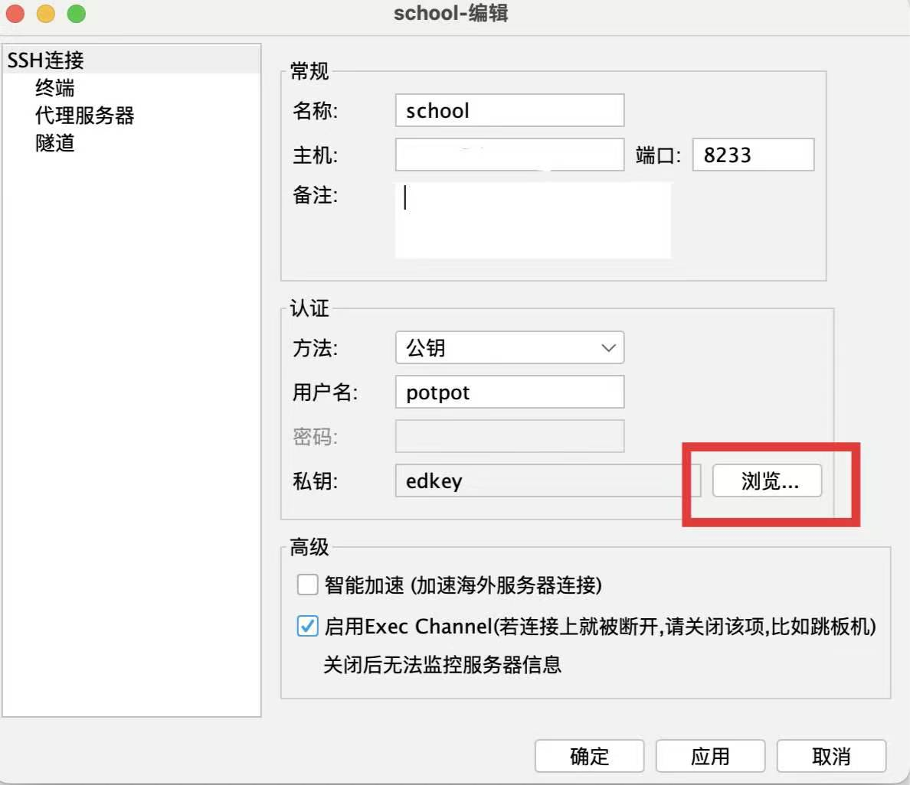
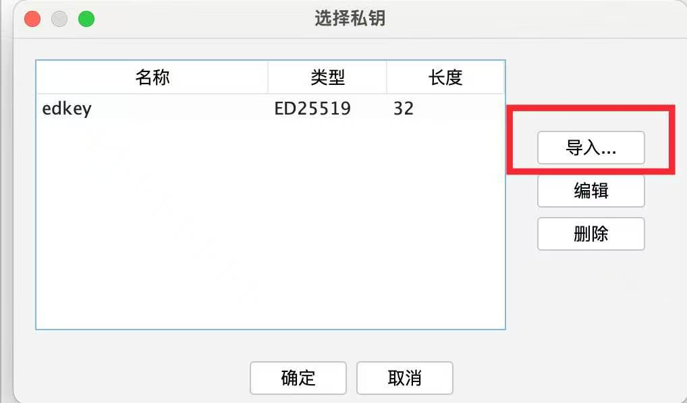
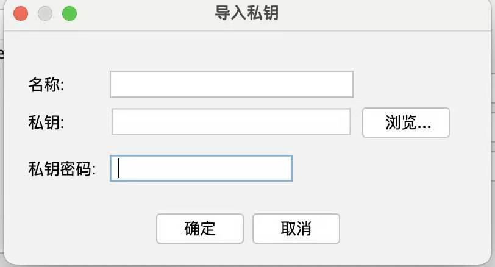

# 前言
最近(~~其实是两个月前~~), 需要在学校服务器上部署一个服务, 于是就有了这么一个事情.

以前都是在自己服务器上部署的, 想用root就用root, 所以对于不是root账号的情况下很多事无法用root解决还是有些不习惯滴. ~~这只能说明我没权限意识(虽然也没出过事)~~

总之, 把这次的经历分享一下, 可能会有一点参考价值吧~

# 第一步, ssh先连上去!
## 先整个账号吧
Linux账号验证有两种方式, 总之先找你的服务器管理员(拥有root的那个man), 然后:
- 提供一个帅气的名字和一个帅气的公钥, 公钥可以在`~/.ssh`目录找到, 单押诶, 最近说了很多单押.
- 也是提供一个帅气的名字, 再让他把帅气的默认密码给你.
### 什么? 你没有公钥
那就创建一个吧, 很简单的, 之后你git也可以拿这个登Github:
```bash
ssh-keygen -t ed25519 -C "你的邮箱@example.com"
```
咱就不用RSA了吧, 椭圆曲线又快又安全, 是吧?

然后输一些信息(记得加下passphrase, 安全意识还是要有点的), 创建成功就可以在`~/.ssh/id_ed25519.pub`找到了
## 登录吧那就
我直接用FinalShell了, 这边配置这个私钥还有点麻烦的, 你得先把它从`.ssh`里挪出来然后再导入进去, 要不然识别不到隐藏文件.

Final Shell的这个导入公钥还有点难找的:



私钥密码就是passphrase.

然后就可以登录上服务器了:)
# 要干啥来着...
哦对, 部署项目, 这个项目是一个前端vue后端python的项目, 我就直接final shell上拷过去了. 然后拷到`/home/[用户名]`下面嗷.

## 后端部署
先pip把requirement.txt装了.(没pip找管理员apt install)

但是pip的bin是在`~/.local/bin`里, 如果要用启动一些没加到PATH里的玩意就往这找.

启动服务的话我是用的systemd, 但是这个得用user的systemd, 比较垃圾, 会话退了就没了.

总之先写好:
```yaml
[Unit]  
Description="服务名"  
After=network.target  
  
[Service]  
WorkingDirectory=工作目录
ExecStart=执行命令
Restart=always  
  
[Install]  
WantedBy=multi-user.target
```
放在`~/.config/systmed/user`下面, 然后要加个`--user`比如`systemctl --user status xxx.service`

刚才说到user的systemd比较垃圾, 那如何解决呢:
```bash
sudo loginctl enable-linger $USER
```
十分滴简单. 当然, 也有可能管理员已经给全局开过了, 毕竟这个还是要sudo的, 比较麻烦.
## 前端部署
这个相对来讲就简单的多了, 直接`npm install`再`npm build`就行.

不过这个配置Nginx就稍微难一点了, 反正后面再讲.

总之现在服务也算是启动起来了.

# 是不是少了点什么...
当然, 启动是启动了, 但别人不能看你启动有个锤子用啊!

那就轮到大名鼎鼎的Nginx登场了, 之前对这个东西一直觉得挺麻烦的, 因为自己之前都用的Lucky, 不得不说Lucky真好用, 还有ddns...

不过这里是别人的地盘, 该用啥还得用啥, 而且技多不压身嘛, 也能了解一些新东西.

这边网上教程挺多的, 就只写个注释吧:

```nginx
upstream backend {  // 类似于声明的操作, 声明一个服务
    server 127.0.0.1:8001; 
}  
  
server {  
	// 这边其实折腾好久, 内网是80访问的, 外网是1234访问的, 所以两个都得listen
    listen 80;  // 学校服务器比较烂, 只支持http
    // 其实这个不listen也行, 管理设置了80全转1234
    listen 1234;  // 80一般运营商不让用, 所以是1234
    server_name xxx.xxx.xxx;  
  
	// 这个不搞似乎会报一个权限错误, 不太清除
    access_log  /home/potpot/logs/xxx.access.log;  
    error_log   /home/potpot/logs/xxx.error.log warn;  
    root /home/potpot/xxx/frontend/dist;  // 刚才build出来的文件夹
  
    client_max_body_size 2g;  // 包体大小限制, 我这个这么大是因为涉及到传文件了
  
    location /api/ {  // 反正我看都这么搞
        proxy_pass http://backend;  
        proxy_http_version 1.1;  
        proxy_set_header Host $host;  
        proxy_set_header X-Real-IP $remote_addr;  
        proxy_set_header X-Forwarded-For $proxy_add_x_forwarded_for;  
        proxy_set_header X-Forwarded-Proto $scheme;  
    }  
  
    location = /welcome {  // 这个是管理搞的欢迎页
        root /home/potpot/www;  
        try_files /index.html =404;  
    }  
  
    location / {  
        try_files $uri $uri/ /index.html =404;  
        error_page 404 = @welcome;  // 没有就fallback到欢迎页
    }  
  
    location @welcome {  // 大概就是类似于fn的东西
        root /home/potpot/www;  
        try_files /index.html =404;  
    }  
}
```

反正也没专门学过, 东拼西凑就写出来了.

最后得先找管理把你的nginx配置文件合到系统的里面, 保存成`xxx.config`然后路径发给管理就行.

最最后, 要`sudo nginx -t && sudo systemctl reload nginx`一下, 看到有sudo? 别慌, 这个一般都在allowlist里(反正我这个在). 每次更新配置文件记得都执行下.

哦对了, 还得找管理要一个子域名(当然ip访问当我没说), 然后就`http://域名:1234`就可以访问了, 这里建议加个http, 要不然可能会认为这是一个https.

到这就成功部署完成了, 好耶!

# 更新有点麻烦呀
*每次都得重新传一遍文件是不是有点麻烦呢?*

那怎么办呢, 众所周知, 程序员都是爱偷懒的, 所以这种时候当然也有对应的工具了, 那就是--git!

没想到吧, git其实不止可以在github上用. git实际上就是一个ssh+scp, 可以创建一个裸仓库作为remote节点然后直接`git push`.

##  具体实现
```bash
// 远程
git init --bare xxx.git // 会在当前目录生成 一个xxx.git文件夹, 存的就是正常.git文件
// 本地
git remote add origin ssh://user@server:/your/path/xxx.git // 格式就是这么个格式
git push -u origin main // 如果远程没有commit就直接提交本地仓库就行
```
这样子每次更新就不用来回传文件了, 直接`git push就行`, 但是每次还得重启systemd和构建前端还是太麻烦了, 有没有什么招呢?
## CI/CD
怎么样, 这个词是不是听起来很熟, 就是Continuous Integration/Continuous Deployment(持续集成/持续部署)了啦.

很显然, 刚才实现的就是CI的部分, 持续集成到远程仓库嘛.

那接下来就要实现持续部署喽, 只需要在git上配置一下, 在remote的裸仓库的hooks加一个post-receive:
```bash
// 虽然是AI写的, 但是我还是解释一下
#!/bin/bash  
// 有人push就执行这个玩意
// 这个从左到右分别是旧的哈希/新的哈希/分支引用路径
while read oldrev newrev refname; do  
    if [ "$refname" = "refs/heads/master" ]; then  // 交到master就执行CD
        echo "=== git checkout ==="  
        git --work-tree=/home/potpot/xxx --git-dir=/home/potpot/xxx.git checkout -f master  // 反正这么写就对了, 不写应该也没事
  
		// 后面就是workflow了
        echo "=== npm install ==="  
        cd /home/potpot/xxx/frontend && npm install  
  
        echo "=== npm run build ==="  
        npm run build  
  
        echo "=== restart backend ==="  
        systemctl --user restart backend.service  
  
        echo "=== Deployed to /home/potpot/xxx ✓ ==="  
    fi  
done
```
写这玩意可能比较遭罪, 但是写完就非常爽了, 可以省去上好多ssh的时间.

# 结语
比较新奇的一次经历, 借此了解到了很多服务部署相关的东西, 也提升了一下用git的水平, 还是挺不错的:)

这次这个结尾好短呀, 最后再补两句吧: 如果你是本校的学生, 这篇博客应该帮你或多或少少踩一些坑了, 如果不是, 希望也可以帮到你~ 无论是Nginx还是CI/CD的部分.