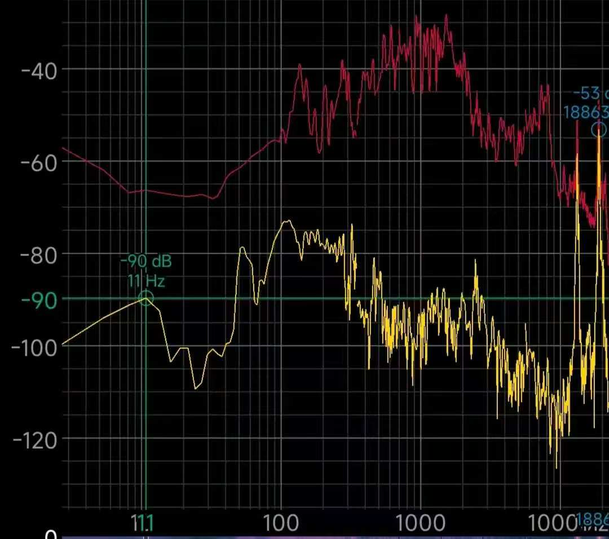
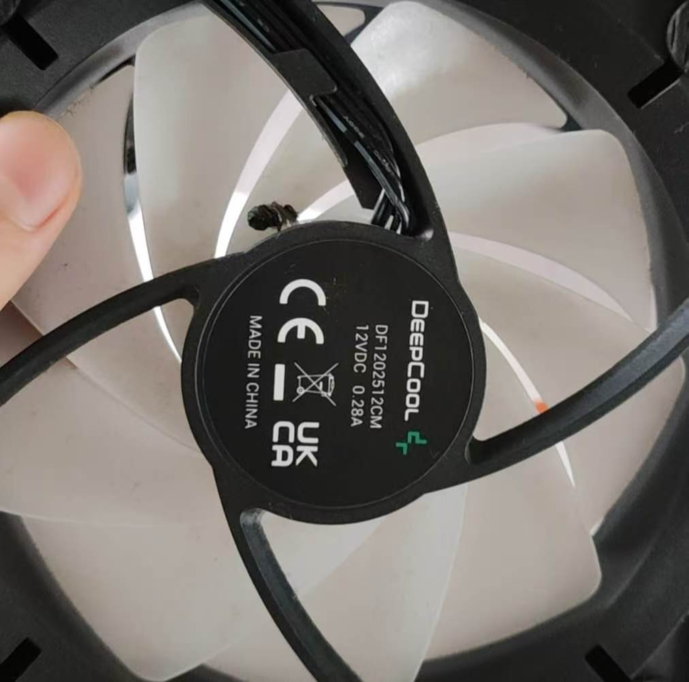
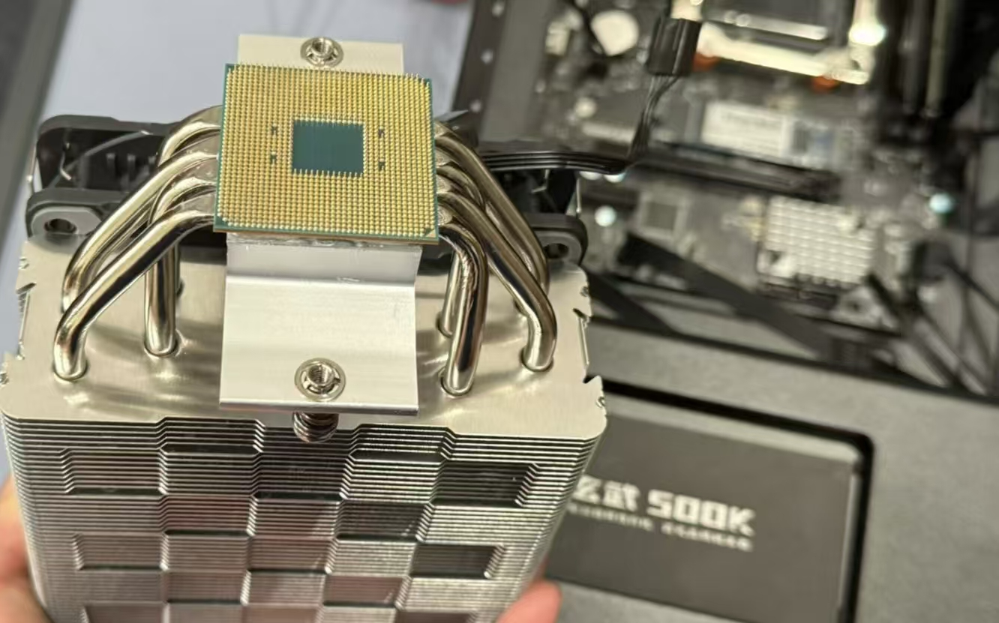

# 起因
这事就得说回到6月14号左右了, 当时服务器有异响, 挺大的, 所以就得解决一下.

其实之前也有异响(高频率啸叫, 不过那个是电源的问题, 当然后面换了个好电源就解决了, 这里就不说了, 不过这种情况的症状是这样的, 这是去年截的图, 可以参考一下这个频率范围, 就是电源问题:

就是下个spectroid然后看高频有没有尖峰就行, 记得然后控制变量.

扯远了, 这次的异响原因很简单--服务器风扇卡了一直苍蝇, 出bug了属于是:)

其实到这按理说结束了就(然后那个风扇真的难取, 这个是散热器上的), 但是我就看散热器上好多灰呀, 就想着要不清下灰.

哦对, 我当时第一次把风扇装回去的时候有根pin线还卡里面了, 服务器过半小时过热关机了, 后来才意识到, 各位装的时候也注意下.

然后就和另一个物理服主约好20号过来清灰/换硅脂/换风扇(说是换个更安静的)/拆显卡(因为之前进bios要用).

# 清灰! 硅脂? 大维护!
然后就开始清灰换风扇了, 这边干的弱智事情也不少, 一个一个说.

先是把机箱擦了下, 然后把散热器拆出来了, 显卡顺手也拿掉了(后面要考), 这次是非常的正常的.

然后我就用各种东西, 什么水龙头/吹风机/wd40搁那洗散热器, 他搁那清机箱那边的灰.

清完灰之后就开始装了, 然后上硅脂, 装好之后就第一次点亮, 意料之中(吗)的没亮, 为什么呢, 有两个问题:
1. 显卡没装, 这个我ssh连不上后的第一反应(因为就动了风扇和显卡), 当然也是主要原因
2. 他那个傻x给风扇装反了, 还是两个都装反了, 装之前还反复确认过风道, 当然这个不导致没亮.
然而并没有先把显卡装上去再测试, 而是直接再继续拆起了散热器, 这一拆不要紧, 一拆直接:

请输入文本

当然这个是后面的图(是的, 就是你想的那样), 反正就是这么个回事...

其实就光这还不要紧, 关键是给这俩扯开的时候还把硅脂抹针脚上了, 这就问题大了.

后来俩人搁那拿牙签和wd40忘针脚上喷. 总是大部分是搞下来了.

然后就是把风扇换成正确的朝向, 显卡装回去, 您猜怎么着, 还是不行.

到这其实已经没招了, 后面都是挣扎, 就是再把cpu取下来再清理, 当然毛用没有, 当然这次没有连根拔起, 我取的. 

最后再补充一个细节, 也是疑点, 当时上散热器的时候有怀疑拧的太松了就多拧了几圈, 在那个时候就可能cpu就已经出事了, 哎呀, 我好像剧透了一点...

最后把服务器拿到他那边去了, 因为那边有显示器, 晚上他尝试了一些形如擦内存金手指之类的常规操作, 但很显然没用.

# 次日...
然后他就让我过去搞, 也是去了,  带了跟线和键盘, 来看看键盘灯能不能亮.

结果就是不行, 也就是成功把问题锁定到主板自检阶段.

这里说一下, 如果键盘灯不亮, 说明主板没过自检, 也就没进bios, 主板的自检顺序为:
1. CPU
2. 内存
3. 硬盘
4. VGA/显卡

显然我们并不知道到底是为啥到底是哪个部分有问题, 所以干脆换个有自检灯的主板(是的, 原来的贪便宜没有自检灯), 有一个自检灯还是很好的, 可以省去很多折腾的时间.

# Long After
中间发生了很多小插曲, 形如新的主板送过来个坏的, 客服扯皮, 终于退换货麻瓜又没时间装...

最后到了7月3号, 终于也是到了, 就开始装, 装完之后就发现, 诶怎么卡的是VGA啊. 

按理说这时候人本能反应也就是换显卡了, 所以就换了个卡, 小黄鱼买的GT1030.

之后又到了12号, 终于说是有空了, 其实这时候我都已经快破防了, 再加上有台风, 暑假还得开服, 非常的急, 不过后面的事又证明了急也毛用没有.

总之一段赶路过去, 把显卡装上, 一点用没有, 这就比较灵异事件了.

那最后也是求助了一个Q群的群友, 说是寄过去看看, 然后就寄过去看看了.

那个群友还让检查一下内存颗粒, 当然也是正常的, 所以说就没有任何的线索了.

到这服已经开不了服了....

# Long Long After
然后就是经过了又一周给寄过去了, 直接就发现这内存咋是intel专用条, 俩人买的时候都不知道有专用条这种东西, 所以各位也注意一下.

然后用店里面的硬件做最小系统测试, 发现问题估计就是CPU和内存了, 所以说这件事告诉了我们一个什么道理呢? 对了, 就是亮VGA不一定是显卡问题.

不过也算是赶上坏时候了, 现在这个CPU和内存价格真的一言难尽, 还好CPU能走保内存能置换, 所以也没花太多钱.

在这之后, 过了又有一个月, 一开始还不习惯没服务器的时候, 但是后来也就还好.

最后, 也就是前两天, 才收到服务器, 并成功进了系统, 搬过去接上网线电源, 就跟什么都没有发生一样...

# 结语
那我在这个事件中收获到了什么呢? 其实啥都没有, 本来从小小的一个清灰酿成如此大的硬件故障, 少不了折腾这个重要的元素. 本来一开始还说是把困扰许久的无法reboot和休眠问题解决了的, 但也没有成功.

我觉得最难得的可能就是这段折腾的经历了吧, 这可能也就是所谓的"极客精神"了.

当然还有那个无光静音风扇:)