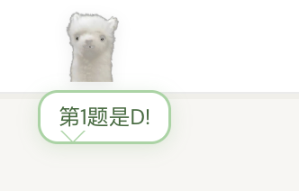
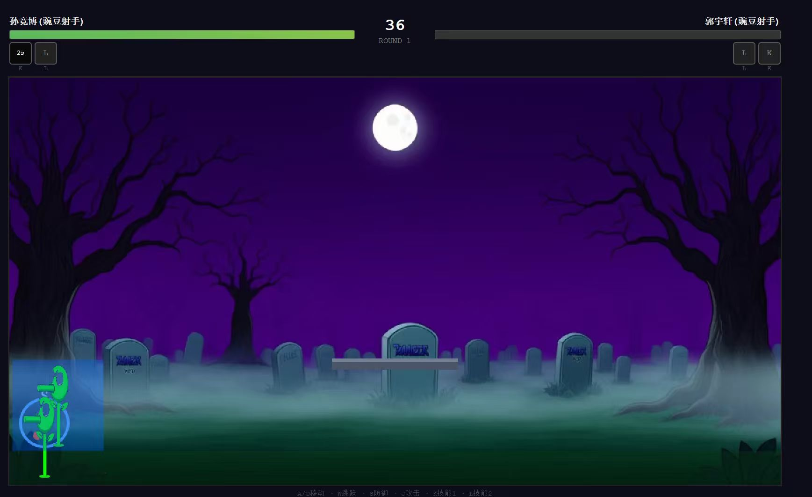

# 起因
因为快AP模考了, 但是我们学校的AP模考因为人太多了, 所以就在食堂考(?). 但是由于食堂网不怎么好, 如果用AP classroom可能会很卡, 所以我CS老师就做了个网站来作为模考网站.

当然, 这个网站不会也不可能是是他自己写的, 就拿Claude生成的. 但是如果这件事就到这我也不说啥了, 但是他就是纯拿Claude生成, 自己不Review, 也不让AI自己Review, 还有严重的安全风险, 就是我接下来要讲的了.
# 第一回合 - 防作弊
他一开始其实是让我们测试了的, 然后出现了, 两个即使是普通用户也能发现的问题:
1. 刷新切屏次数会清零
2. iPad/iOS的系统级别手势(如分屏)不会被判定

防作弊大概就是这么个东西, 检测到你切屏就会增加次数.

## 解决
总之这两个bug还是很好修的:
1. 每次保存考试状态, 顺便同步到服务端
2. 用强制全屏+pwa模式

但是你以为到这就结束了吗?

当然没有, 事实上, 防切屏这个功能在浏览器上是实现不了的, 这也是为什么AP要用BlueBook这样的应用的原因, 浏览器上的前端是可以随便改的.

那么具体怎么做呢?

这里的方案其实很多, 我具体列举几个:
1. F12直接删防切屏遮罩.
2. 翻前端原码, 可以发现有一个`triggerAntiCheat()`的函数, 直接控制台`triggerAntiCheat=undefined`或修改成其他东西.(由[ZGWest566](https://github.com/ZGWest566)发现)
3. 依旧翻前端源码, 可以发现有一个`S.tabSwitches`的变量来记录切屏次数, 直接改成0就行.(由[ZGWest566](https://github.com/ZGWest566)发现)
不过1和3都不是最稳妥的, 后来都被修了. 只有2, 改源码才是最无解的.
>[!NOTE] 怎么修的?
>1. 检测遮罩元素是否存在, 如果不存在, 触发切屏检测+生成遮罩.
>2. 把切屏次数上传至后端, 每次从后端同步, 后端只允许递增.

至此, **防切屏**的回合就结束了, 此为一胜.

## 第二回合 - 获取答案
这一部分有两个我与[ZGWest566](https://github.com/ZGWest566)分别独立的成果, 在深入交流后总结.
## 《答案存前端》
总之这波AI也是神了, 点进前端代码`app.js`可以发现头几行定义了一个S, 如下:
```Javascript
const S = {
  teacher: null,
  student: null,
  role: null,
  token: null,
  editingExamId: null,
  draftQuestions: [],
  choiceCount: 4,
  editingQIdx: null,
  draftQImg: null,
  draftQImgFile: null,
  draftQImg2: null,
  draftQImgFile2: null,
  activeExam: null,
  currentQIdx: 0,
  answers: {},
  tabSwitches: 0,
  _lastAntiCheatTime: 0,
  _timerInterval: null,
  _timerSecondsLeft: 0,
  _heartbeatInterval: null,
  _acVisibility: null,
  _acBlur: null,
  _acFocus: null,
  _acBlurTimer: null,
  viewingKeysExamId: null,
  viewingKeysData: [],
  eliminatedChoices: {},
  _currentExamRecords: [],
  _currentExamQuestions: [],
  _currentExamName: "",
};
```
这个S里面基本上都是所有全局的变量了.

原来, 在`S.sctiveExam`里记录的是所有的试卷信息, 字段有`index`, `answer`, `img`, `choice`之类的. 当然也有`correct_answer`, 是关于`S.activeExam[i].choice`的一个index, S.choice是一个由A-D或其他选项组成的一个列表, 所以, `S.activeExam[i].choice[S.activeExam[i].correct_answer]`就是正确答案了.

后来[ZGWest566](https://github.com/ZGWest566)还写了个插件, 按q可以显示答案.

不过, 后来这个bug被修了, 但是还可以用下一个方法...
## 《接口不鉴权》
继续翻源码, 在和exam有关的函数里发现有`api/questions/S.examID`之类的字段, 所以不妨猜测, `api/questions`这个接口下返回的就是对应考试的题目列表.

那就访问一下试试吧---果然, 返回的就是题目列表, 没有做任何的验证, 直接就可以拿到所以题目以及正确答案.

那接下来的事情就简单了, 写个python脚本, 或者直接复制这段代码拿到题目列表, 写个浏览器插件.

不过又过了一天, 他最终还是发现了这个bug, 然后修了, 但依旧是如修.

现在这个接口是获取不了了, 但是真的---其实不然, 由于这是get请求, 所以只要再这个请求后面携带一个`role:'teacher'`, 也就是在链接后面加一个`?role=teacher`就可以正常获取了.

其实他在这个时间点已经反应过来加了token系统来判断权限了, 但是只应用了部分接口, 这个留到下一回合讲.

总之, 获取答案, 此为二胜.

# 第三回合 - 登录教师端
依旧是那个S, 看到那个`S.role`了吗, 之前他是用这个来判断你的身份的, 如果是"teacher", 就可以直接登录教师端, 绕过登录验证.

不过还是得进行一些额外操作的, 比如`S.teacher.id`要改成"teacher-1"或其他的. 这样才能获取到所有考试的列表.

在这之后, 你就可以随意登录教师端进行任意操作了.

当然, 在上一回合的同一时间节点, 他也把这个bug修了, 具体就是加了个token系统, 每次登录分配一个token, 后端存一个表映射token到用户名, 来判断身份.

不过这个token验证系统只覆盖到了`/api/exams/all`和其他修改考试相关的接口, 所以只要不用这个接口来获取考试列表就行了, 可以用学生端的`/api/student/exams`, 携带一个`student_key_id`, 不过这样子获取的考试列表只有学生端有的才行, 如果对应的考试没有该学生的话就看不了.

*那么具体怎么实现呢?*

1. 先把`app.js`和`index.html`之类的前端代码下载一份到本地, 因为不下载没法改代码.
2. 把`app.js`里涉及到教师端获取考试列表的接口换成/api/student/exams
3. 保存, 运行本地的前端代码.
不过学生端的api还是有点区别的, 要在.exam下才是考试列表.

总之, 也是成功登上了教师端, 此为三胜.

# 其他功能
## 豆包弹窗
html有一个标签, 叫做`iframe`可以将网页内嵌在另一个网页内. 因此, 就可以通过这个东西内嵌豆包了.

附上代码:
```javascript
const targetDiv = document.getElementById('screen-exam');// 获取父元素--考试页面
if (targetDiv) {// 检测父元素是否存在
    // 定义 iframe 元素
    const iframe = document.createElement('iframe');
    iframe.src = 'https://www.doubao.com';
    iframe.style.cssText = `
        position: fixed;
        top: 50%;
        left: 50%;
        width: 1280px;
        height: 720px;
        transform: translate(-50%, -50%) scale(0.75);
        transform-origin: center center;
        border: none;
        border-radius: 12px;
        box-shadow: 0 12px 40px rgba(0,0,0,0.4);
        z-index: 9999;
    `;
    // width&height定义内嵌元素的大小(可以理解为里面套了个显示器), 里面的元素会自适应这个分辨率
    // transform再把它缩放到合适的大小
    iframe.className = 'doubao-injected-iframe';
    // 检测元素是否存在
    const existing = targetDiv.querySelector('.doubao-injected-iframe');
    if(existing){
	    // 隐藏/显示
        existing.style.display = existing.style.display === 'none' ? 'block' : 'none';
    }
    // 生成iframe
    else targetDiv.appendChild(iframe);
}

```
## 羊驼提示答案
后来, 他又搞了一个羊驼吉祥物, 长这样:

我直接就来灵感了, 既然这是个可以显示文字的地方, 那我的答案不也可以显示在这里嘛, 而且很隐蔽, 一般人根本发现不了.

*那么怎么做呢?*

这个羊驼其实是独立于所有页面之上的固定的东西, 对话框也是, 而对话框做到隐藏和弹出其实也就是`display`的属性, 改成`none`就隐藏, `block`就显示. 不过我就不用这么麻烦了, 因为AI写了个`show`的class, 所以只要我把class改成`show`就行了.

### 代码
```javascript
function showAlpaca(message, duration = 1000){
    const element = document.getElementById('alpaca-bubble');
    element.className = 'show';// 改class名
    element.textContent = message;// 改变内容为要现实的文字
    element.style.cssText = 'left: 208px; top: 52px;';// 这是因为这是个浮窗, 所以要指定位置
    if (duration > 0) {// 延时隐藏
        setTimeout(() => {
            element.className = '';// 再换回去(隐藏)
        }, duration);
    }
}
```

### 效果


也是非常的nice啊.

# 后传
此篇写于网站被Hack之后的几周.
## 网站更新
后来他又出了个做简答题(FRQ)的功能, 那对应的, 教师端肯定也开放了FRQ相关的接口.

接下来的事就很简单了:
1. 把新的`app.js`和`index.html`下下来
2. 把原来`/api/exams/all`的接口换成`/api/student/exams`
但是这里AI其实还改了一部分代码, 除了获取考试列表以显示的那次调用, 在"获取学生成绩"和"查看成绩"的这两个地方也调用了, 所以得一并换了.

所以我就想着封装一下, 写了个方法:
```javascript
let STUDENT_NAME="name";// 方便在console改学生名字
// change the /exams/all api to /student/exam
async function getExamsByStudent(){// 因为网络请求是异步的, 所以此方法也得是异步
  let exams = await api("GET", "/api/student/exams",{student_name:STUDENT_NAME});// 因为这个是异步的
  let exams2=[];
  for(let i=0;i<exams.length;i++){// 处理数据,为什么要处理见上文
        exams2.push(exams[i].exam);
    }
  return exams2;
}
```
由于这个方法是异步的, 所以调用的时候也得加下await.

总之现在也可以看FRQ了, 所有人的答案都是可以看的(能不能批我不知道).
## 小游戏
最近他又拿AI做了个双人对打版的植物大战僵尸, 长这样, 挺诡异的:

那我自然是想Hack一下的~~话说这能叫Hack吗~~

那AI依旧也是不讲记性, 所有逻辑都放到了前端, 也是没有听进去我说的**前端零信任**好吧.

不过稍微有点不一样的是他把主逻辑写到`index.html`里了, 所以我还是找了一会的~~虽然最后是拿Claude找的, 不得不说, Claude真好用~~

但是找到了其实你也不能调, 因为整个游戏是一个**嵌套函数**, 所有逻辑代码都在一个`startGameEngine`方法里.

不能调那咱就别调了呗, 所以就直接改代码, 找到里面有个叫`applyHit`的方法用来造成伤害, 直接改成:
```javascript
function applyHit(def,dmg,kbVx,kbVy){
    if(iAmP1){// 如果自己是P1
        p2.hp=0;// 把P2生命变成0
        if(p2.hp<=0)endGame();
    }else{// 反之同理
        p1.hp=0;
        if(p1.hp<=0)endGame();
    }
}
```
其实我一开始还绕了下弯子, 还把这段script从`index.html`里分离出来了, 然后发现这是个嵌套函数没法调, 然后想办法把它放到全局作用域里, 最后反应过来可以直接改代码.

不过这样要写插件的话就没啥办法了估计, 或者说script改完也会重新加载? 反正我也就自己玩玩.
# 结语
有关Hack这个项目的所有东西都已经开源到了[Github](https://github.com/re01redstone/HackSimon)上了. 这个项目~~或许称不上是项目~~是[我](https://github.com/re01redstone)与[ZGWest566](https://github.com/ZGWest566)共同维护的, 当然也仅供娱乐.

另外, 如果真的是本校的学生, 也**请不要作弊**, 诚信考试好吧. 毕竟学校的考试可以作弊, 但是你AP大考还能作弊吗. 这个项目只是用于研究和图一乐的, 当然我也不知道他啥时候会发现.

## 关于AI
不过将AI写的代码不进行**全方位的测试**或者**review**就**直接放入生产环境**的这种行为还是**极其不提倡**的, 你也不知道AI会不会写出比本文提到的还要逆天的代码, 所以还是**慎用AI**.

当然, 我也不是讨厌AI写代码, 搞得像动了我的蛋糕一样, 正如经济学所阐述的一样, 科技会提升productivity, 进而提升MRP, AI并不会取代人类, 而是作为complement, 作为工具提升人类的产能.

不过最最关键的还是要适当使用了.